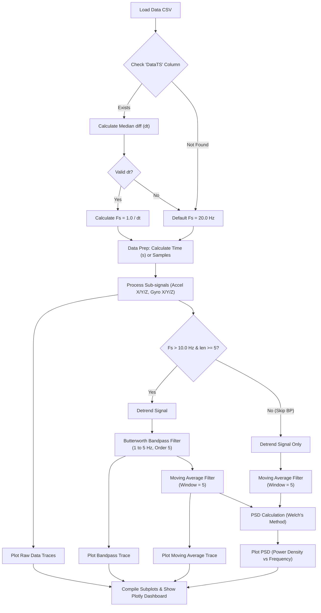

# Signal Processing Pipeline Diagrams

Here is the pipeline diagram mapping out each processing step found in your signal extraction tools.

## Pipeline Diagram (`plot_signal_stages.py`)
This flowchart outlines the logic utilized in the `plot_signal_stages.py` script for calculating and filtering accelerometer and gyroscope data.

> [!NOTE]
> The same general processing flow applies to the signal feature extractions developed in `jupyter_notebooks/plot_psd_features.ipynb`, which reads the input data and subsequently performs validation, detrending, filtering, and Welch's PSD calculation to construct the signal features.
